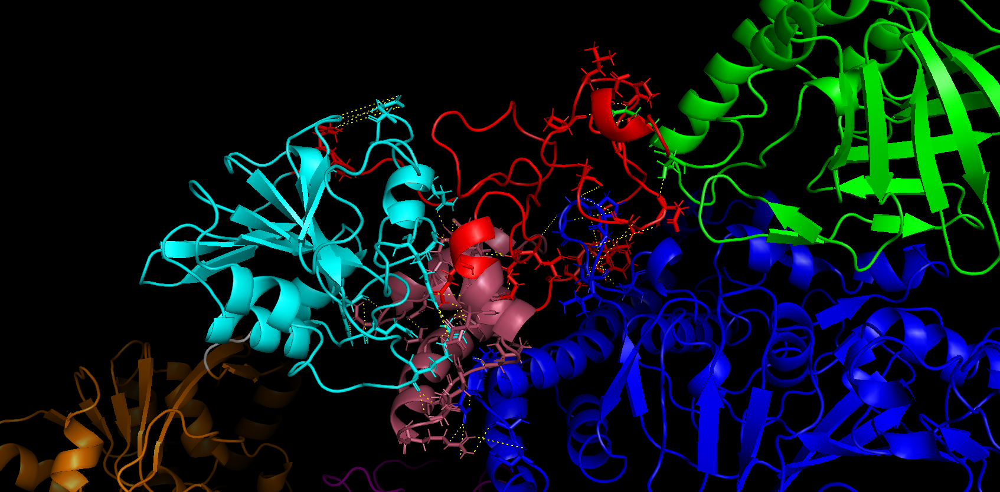

# Purpose

From the contacts retrieved from a molecular dynamics simulation with the [plot_contacts.py script](https://github.com/njeanne/plot_contacts), a
representation of this contacts will be performed on a structure file of a protein. The `.pse` file can be visualized
with [PyMol](https://github.com/schrodinger/pymol-open-source).

# Environment

A [Conda](https://docs.conda.io/en/latest/) environment is provided in the `env` directory and can be loaded with the
command:
```shell
conda env create -f conda_env/pymol_contacts_md_env.yml
```

# Usage

The example files provided in the `data` directory can be used to test the script.

**Important**: In the input CSV data file, when in a row representing the contacts between 2 residues, multiple contacts are recorded 
between the atoms of the 2 residues, the contacts in the column `atoms contacts` must be separated by a "` | `" 
character with a space on each side.

## Basic usage

The basic usage is:
```shell
conda activate pymol_contacts_md

./pymol_contacts_md.py --prefix results/sample-X --domains data/sample-X_domains.csv \
--structure data/sample-X_cluster.pdb  data/hydrogen-bonds_sample-X.csv

conda deactivate
```
This will produce a the `results/sample-X.pse` file that can be opened with [PyMol](https://github.com/schrodinger/pymol-open-source),
adding 61 contacts from 42 pairs of residues.

The persistent contacts during the Molecular Dynamics simulation between the atoms of different residues are added with 
yellow dots:



## Excluding domains

In the CSV input file, the domains of the second atom can be excluded, column `second partner domain`. If we want to
exclude the contacts between the PPR and itself and also the PPR and the X domain, the command will be:
```shell
conda activate pymol_contacts_md

./pymol_contacts_md.py --prefix results/sample-X --domains data/sample-X_domains.csv \
--exclude-domains PPR "Macro Domain" --structure data/sample-X_cluster.pdb  data/hydrogen-bonds_sample-X.csv

conda deactivate
```

This will produce a the `results/sample-X.pse` file that can be opened with [PyMol](https://github.com/schrodinger/pymol-open-source), 
removing 33 contacts being parts of the excluded domains, to finally add 28/61 contacts added for 22/42 pairs of 
residues:


## Selecting a Region Of Interest (ROI)

A region of interest in the CSV input file can be selected to add only the residue 1 positions contacts which 
coordinates are in the targeted region of interest:

Here, we target an insertion which coordinates are amino acid 748 to 806:
```shell
conda activate pymol_contacts_md

./pymol_contacts_md.py --prefix results/sample-X_roi-748-806 --domains data/sample-X_domains.csv \
--roi 748-806 --structure data/sample-X_cluster.pdb  data/hydrogen-bonds_sample-X.csv

conda deactivate
```

This will produce a the `results/sample-X_roi-748-806.pse` file that can be opened with [PyMol](https://github.com/schrodinger/pymol-open-source), removing 24 
contacts for which residue 1 position is outside of the region of interest 748 to 806, to finally adding 37/61 contacts 
for 22/42 pairs of residues:


